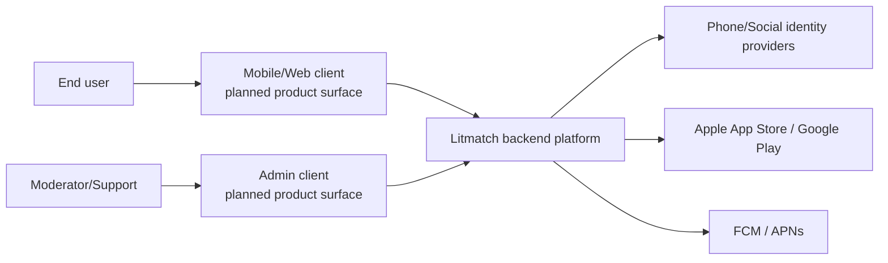
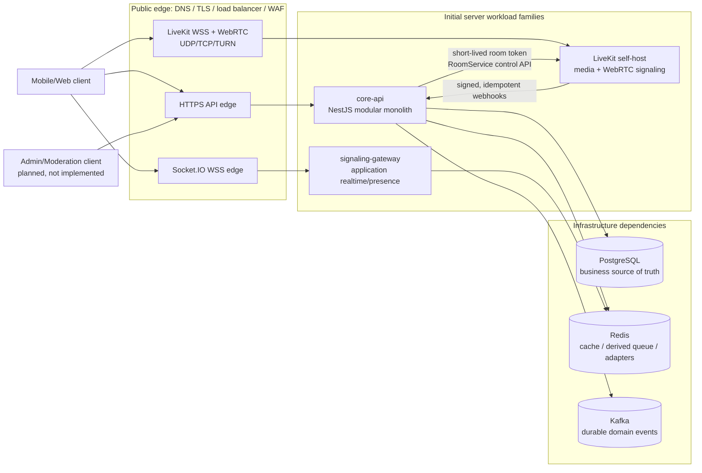

[← 02 · Domain Model](./02-domain-model.md) · **03 · Architecture** · [04 · Tech Stack →](./04-tech-stack.md)

# 3. Kiến trúc nền tảng — Modular Monolith trước, tách theo số liệu

> Mục tiêu dài hạn là quy mô lớn, nhưng mọi quyết định scale phải truy được về workload/SLO và bằng chứng đo trong [11-nfr-and-production-readiness.md](./11-nfr-and-production-readiness.md). “Litmatch-scale” không thay thế capacity plan.

## 3.1 Vì sao không chia nhiều microservice ngay từ đầu

`core-api` bắt đầu dưới dạng modular monolith: domain boundary rõ, API export rõ, dữ liệu có chủ sở hữu và test kiến trúc chặn import nội bộ trái phép. Cách này tránh chi phí network/deploy/observability của nhiều service khi chưa có số liệu, nhưng vẫn giữ đường tách module về sau.

MonolithFirst không có nghĩa là mọi thứ chạy chung một process. Realtime connection và media có đặc tính scale/network khác hẳn business API nên được tách thành workload riêng từ đầu; các domain Auth/User/Matching/Economy/... vẫn là module trong `core-api`.

## 3.2 Kiến trúc đề xuất

### 3.2.1 System context



Client/admin chưa nằm trong repo không có nghĩa chúng bị cấm bởi server-workload invariant; chúng là product surface riêng, cần ADR stack/security/release trước khi triển khai.

### 3.2.2 Container/deployment topology



Ba workload server ban đầu là:

1. **`core-api`** — modular monolith chứa business logic và nguồn quyết định nghiệp vụ.
2. **`signaling-gateway`** — Socket.IO cho application realtime như presence, trạng thái session, chat/control intent; không proxy SDP/ICE của LiveKit.
3. **LiveKit self-host** — WebRTC signaling/media plane. `apps/media-server` hiện là thư mục cấu hình/deployment cho image LiveKit, không phải một app NestJS/Nx tự viết.

PostgreSQL, Redis, Kafka, load balancer và TURN là hạ tầng phụ thuộc, không phải business-domain service. Mobile/web/admin client cũng không phải server-domain service. Worker dùng cùng codebase (outbox relay, sweeper, reconciliation) có thể chạy trong process hiện tại hoặc thành deployment riêng khi cần, nhưng phải ghi rõ ownership, idempotency, singleton/leader semantics và tiêu chí scale.

**Luật boundary chính xác**: không tự tạo business-domain service độc lập thứ tư. Nếu muốn tách một module khỏi `core-api`, phải có ADR + số liệu đáp ứng § 3.4. Luật này không cấm client app, admin tool, migration job, worker deployment hay infrastructure component.

### 3.2.3 Voice Match — luồng control và media

```mermaid
sequenceDiagram
    autonumber
    participant A as Client A
    participant B as Client B
    participant Core as core-api
    participant WS as signaling-gateway
    participant LK as LiveKit

    A->>Core: Create/confirm match ticket
    B->>Core: Create/confirm match ticket
    Core->>Core: Create confirmed MatchSession/CallSession
    Core-->>A: Session + short-lived scoped LiveKit token
    Core-->>B: Session + short-lived scoped LiveKit token
    A->>WS: Join application session (WSS)
    B->>WS: Join application session (WSS)
    A->>LK: Connect directly (LiveKit WSS/WebRTC)
    B->>LK: Connect directly (LiveKit WSS/WebRTC)
    LK-->>Core: Signed participant/room webhooks
    Core->>Core: Reconcile server-authoritative state; start billing only when policy permits
    A->>WS: mute/end/control intent
    WS->>Core: Authorize intent against current session/role
    Core->>LK: RoomService API command
    LK-->>Core: Command result/webhook
    Core-->>WS: Authoritative state update
    WS-->>A: Session update
    WS-->>B: Session update
```

Client kết nối trực tiếp tới LiveKit bằng token ngắn hạn, scope đúng room/participant/grant. LiveKit có biết identity và permission được ký trong token để enforce media access, nhưng không query DB và không tự quyết định giá, match, VIP hay role nghiệp vụ. `core-api` vẫn là nguồn quyết định và **caller duy nhất giữ LiveKit API secret/gọi RoomService**. Signaling Gateway gửi control intent về `core-api`, không giữ secret/call LiveKit trực tiếp; webhook/control response phải idempotent và được reconcile với state trong Postgres.

## 3.3 Vì sao Signaling Gateway + Media Server tách khỏi `core-api`

- **Signaling Gateway** scale theo số kết nối Socket.IO đồng thời và fanout application event; `core-api` scale theo CPU/DB/request. Tách workload tránh kéo toàn bộ monolith theo số socket.
- **LiveKit** là media workload độc lập, cần public WebRTC connectivity, UDP/TCP/TURN, TLS, node draining và capacity test riêng. Nó không phải “sidecar mediasoup” gắn 1:1 với Signaling Gateway.
- Socket.IO và LiveKit không làm trùng vai trò: Socket.IO giữ application realtime/control intent; LiveKit SDK/server xử lý WebRTC signaling, track và media transport.

## 3.4 Tiêu chí tách 1 module ra thành service riêng

Chỉ tách module khỏi `core-api` khi ADR chứng minh ít nhất một điều sau:

1. Cần scale độc lập với tốc độ khác hẳn và đã có metric/profile chứng minh.
2. Cần runtime/công nghệ khác hẳn.
3. Cần cô lập bảo mật, tuân thủ hoặc blast radius riêng.
4. Có ownership/team và chu kỳ deploy độc lập thực sự.

ADR phải ghi source-of-truth, hợp đồng API/event, migration dữ liệu, consistency/failure model, rollback và cost vận hành. Việc tạo worker từ cùng codebase chưa mặc nhiên là tách business service.

## 3.5 Capacity Media/SFU — đo theo publisher/subscriber, không dùng hằng số chung

LiveKit self-host hỗ trợ nhiều node với Redis, nhưng **một room được host trên một node**. Multi-node làm tăng số room đồng thời và khả năng dự phòng; không chia một room self-host qua nhiều node. Xem [LiveKit Distributed multi-region](https://docs.livekit.io/transport/self-hosting/distributed/) và [Self-hosting overview](https://docs.livekit.io/transport/self-hosting/).

Tải SFU phụ thuộc số track publish, số subscriber thực nhận, bitrate/codec, packet rate và phần cứng:

- Voice Match 1-1: 2 audio publisher và 2 subscription media.
- Party Room có `N` participant nhưng chỉ `S` speaker publish: nếu mọi participant subscribe mọi speaker thì số subscription xấp xỉ `S × (N - 1)`, **không phải mặc định `N × (N - 1)`**.
- Speaker/participant cap phải là config server-side. Giá trị chỉ được tăng sau load test đúng topology/codec/instance production; benchmark vendor chỉ là tham khảo, không phải capacity guarantee ([LiveKit Benchmarking](https://docs.livekit.io/transport/self-hosting/benchmark)).
- Khi scale: thêm node để phân phối **room mới**, dùng Redis/node selector, load balancer region-aware và draining. Nếu yêu cầu một room trải nhiều node/global edge, phải đánh giá LiveKit Cloud hoặc kiến trúc khác bằng ADR; không ghi “bật cascade self-host” như một config có sẵn.

## 3.6 Transaction boundary, Saga, Outbox và Inbox

Không chọn Saga chỉ vì hai module có tên khác nhau:

- Thao tác tức thời, cùng PostgreSQL và cần một invariant atomic (ví dụ hai chân Gift DIA/PTS) dùng **một local DB transaction**.
- Luồng kéo dài theo thời gian hoặc đi qua network/external system (Match → Call → billing tick → settle) dùng durable state machine/orchestrator + idempotency + compensation; không giữ DB transaction xuyên cả cuộc gọi.
- Side effect không quyết định tính đúng đắn (notification/analytics) đi qua event.

Khi update DB và publish event, ghi `outbox_events` cùng local transaction. Relay có thể chạy trong `core-api` hoặc worker cùng codebase; chạy nhiều instance phải claim bằng `FOR UPDATE SKIP LOCKED`. Event Economy chuẩn dùng namespace nhất quán, ví dụ `economy.diamond.debited`, không dùng đồng thời `diamond.deducted`/`economy.diamond.deducted`.

Consumer phải có Inbox/dedup theo `eventId`, retry có giới hạn, dead-letter policy và metric lag/error. Event contract tối thiểu có `eventId`, `version`, `occurredAt`, `traceId`, aggregate/partition key và payload versioned.

## 3.7 Giao tiếp giữa các phần

- **Giữa module trong `core-api`**: gọi qua public interface/DI; không dựng REST/gRPC nội bộ.
- **Client → `core-api`**: HTTPS REST versioned; auth/rate-limit tại public edge và app.
- **Client → Signaling Gateway**: Socket.IO/WSS cho application realtime; Redis adapter khi nhiều instance, nhưng Postgres/business module vẫn là nguồn state nghiệp vụ.
- **Client → LiveKit**: kết nối trực tiếp bằng LiveKit SDK tới public WSS/WebRTC/TURN endpoint, sau khi nhận token scope hẹp từ backend.
- **`core-api` → LiveKit**: private RoomService/control API; `core-api` là caller duy nhất giữ API secret, kiểm tra authorization, chờ kết quả và reconcile webhook. Signaling Gateway chuyển intent về `core-api`, không gọi LiveKit trực tiếp nếu chưa có ADR ủy quyền riêng.
- **LiveKit → backend**: webhook public có xác thực chữ ký, durable inbox và idempotency.
- Check/trừ diamond luôn đồng bộ với Economy + transaction DB; event chỉ dùng cho phản ứng phụ.

Protocol chi tiết, service authentication, timeout/retry và endpoint ownership phải được chốt trong service spec/ADR trước M3; không để cụm “REST hoặc gRPC” cho implementation tự chọn.

## 3.8 Quyết định cần đúng từ đầu; scale runtime theo bằng chứng

### A. Media/SFU — LiveKit self-host, single-node-per-room

**Đã chốt (2026-07-10): LiveKit self-host** cho media plane. Thiết kế phải theo § 3.2/3.5: client kết nối trực tiếp; token room-scoped; Redis cho distributed room placement; một room nằm trên một node; capacity đo bằng publisher/subscriber workload. Production checklist nằm ở [11 § 11.5](./11-nfr-and-production-readiness.md).

### B. Matching — Postgres source of truth, Redis derived queue shard

- `MatchTicket` là business state trong Postgres; Redis sorted set chỉ là index/queue dẫn xuất để tìm candidate nhanh.
- Shard hiện tại theo `(matchType, region, ageBand)`. Matcher phải kiểm tra criteria **hai chiều** trước khi pair và CAS/lock trạng thái Postgres để không match đôi.
- M1 dùng DB queue-outbox + full reconcile để rebuild Redis, và lease owner/deadline để worker crash không consume ticket vĩnh viễn. Trước production phải có chaos evidence Redis restart/kill worker và metric reconcile.
- Fairness phải đo bằng wait-time distribution; speed-up có cap và không được làm user thường starvation. Widening shard/criteria chỉ thực hiện theo policy versioned.

Đặc tả M1 và các gap production: [services/matching-service.md](./services/matching-service.md).

### C. Economy/Wallet — double-entry ledger

- Mỗi giao dịch ghi ít nhất hai `LedgerEntry`, tổng Nợ = tổng Có theo currency; ledger append-only, sửa bằng reversal.
- `Wallet.balance` là snapshot dẫn xuất, cập nhật cùng local DB transaction và rebuild được.
- Idempotency nằm ở transaction nghiệp vụ, không ở từng ledger entry. Client key phải được scope theo operation + actor (hoặc được namespace server-side), lưu canonical request hash và replay đúng kết quả cũ.
- PostgreSQL concurrent unique insert có thể block tới khi transaction cạnh tranh commit/rollback; implementation phải dùng `ON CONFLICT`/savepoint/rollback đúng, không giả định có thể đọc row chưa commit.
- Partition/engine ledger chuyên dụng chỉ xem xét khi metric chứng minh Postgres đã tối ưu vẫn không đạt NFR.

Chi tiết: [services/economy-service.md](./services/economy-service.md) và production gates R-004/R-005 trong [07-roadmap.md](./07-roadmap.md).

---
[← 02 · Domain Model](./02-domain-model.md) · [04 · Tech Stack →](./04-tech-stack.md)
