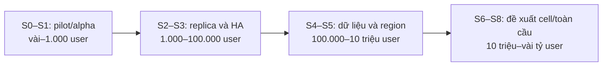

# 2026-10-08 — Capacity và lộ trình scale từ vài user tới vài tỷ

Đây là phân tích kịch bản và kế hoạch có ngày cho checkout `250c2a0`, không phải chứng nhận tải
production. Mốc/trigger hiện hành được quản lý trong [roadmap § 7.3](../07-roadmap.md#73-lộ-trình-quy-mô-từ-vài-user-tới-vài-tỷ).
[Architecture](../03-architecture.md), [tech stack](../04-tech-stack.md), ADR và service spec vẫn
quyết định hệ thống được phép vận hành như thế nào. Công nghệ tương lai dưới đây là phương án
cần đánh giá, không tự trở thành stack đã chọn.

## 1. Objective, phạm vi và acceptance

- **Objective:** chia quy mô theo user, truy cập đồng thời và dữ liệu; giải thích mô hình, kỹ thuật,
  thời điểm áp dụng và evidence cần có để chuyển giai đoạn.
- **Scope:** roadmap và tài liệu phân tích. Không provision, đổi code/schema, bật provider hoặc
  chạy tải vào một deployment chưa được chỉ định.
- **Acceptance:** có vị trí hiện tại theo repository evidence; S0–S8; lộ trình dữ liệu độc lập;
  phân biệt user/CCU/socket/RPS; gate chuyển mốc và backlog thực thi gần nhất.
- **Invariant:** ba backend deployable; domain ở Core API; Postgres giữ durable state;
  Economy double-entry, append-only và DB-unique transaction idempotency không đổi.
- **Checks:** `pnpm docs:check`, `pnpm agent:check`, format check. `review-module: N/A` vì không
  thay đổi business flow hoặc triển khai kỹ thuật trong task này.

## 2. Cách xác định dự án đang ở đâu

Có hai trục tiến độ cần đọc riêng:

| Trục                                | Câu hỏi                                                           | Nguồn evidence                                                                                              |
| ----------------------------------- | ----------------------------------------------------------------- | ----------------------------------------------------------------------------------------------------------- |
| Capability/delivery — Giai đoạn 0–7 | Tính năng/contract nào có source, còn thiếu readiness nào?        | [Roadmap](../07-roadmap.md), [feature registry](../feature-registry.json), runtime capability               |
| Quy mô — S0–S8                      | Deployment đã chịu được tải nào với SLO, recovery và chi phí nào? | Capacity report theo workload, telemetry và [reliability gate](../runbooks/reliability-slo-and-evidence.md) |

Tại thời điểm lập plan, repository có Core API modular monolith, Signaling Gateway và Media
Server; có profile alpha, K8s/HPA, matching shard, realtime Redis adapter/quota và load-test
scaffold. Đây là evidence của nền tảng thiết kế. [K8s guide](../../k8s/README.md) vẫn mô tả
resource/HPA như điểm khởi đầu chưa benchmark, media mặc định một replica; [load-test guide](../../loadtest/README.md)
không chứng nhận production capacity. Không dùng số pod trong YAML để kết luận số user chịu được.

Vì chưa có báo cáo capacity production được dẫn trong roadmap, điểm xuất phát của kế hoạch là
**kiểm chứng pilot S0 → S1**. Deployment thực tế có thể khác; cần số liệu để phân loại lại. Những
capability có source/test vẫn có thể cần provider smoke hoặc UX hoàn chỉnh trước khi bật cho user.



Sơ đồ thể hiện thứ tự đánh giá, không bắt buộc đổi topology khi vừa chạm một con số user.

## 3. Định nghĩa tải và giả định

| Chỉ số            | Ý nghĩa                                                  | Tầng chịu áp lực chính                               |
| ----------------- | -------------------------------------------------------- | ---------------------------------------------------- |
| User tích lũy     | Tổng tài khoản đã tạo, gồm tài khoản không còn hoạt động | Lưu trữ identity/profile; không xác định throughput  |
| MAU / DAU         | Người hoạt động trong tháng / ngày                       | Độ phổ biến thực tế, số hành động và retention       |
| Peak CCU          | Người online đồng thời tại đỉnh                          | API, signaling, presence và một phần media           |
| Kết nối socket    | Kết nối sống; một user có thể có nhiều tab/device        | RAM, file descriptor, TLS, heartbeat, reconnect      |
| RPS / event rate  | Request/giây và event/giây, đo ingress và fanout riêng   | CPU, DB, broker, network; khác số người online       |
| Media concurrency | Room, publisher, subscriber, track và bitrate đồng thời  | SFU, CPU, packet rate, NIC và egress                 |
| Dữ liệu           | Bản ghi/byte tích lũy, byte mới/ngày, hot working set    | DB/index, object storage, backup, restore, analytics |

Giả định minh họa, cần thay bằng số đo trước khi sizing:

| Giả định                              | Giá trị ví dụ              | Giới hạn                                                        |
| ------------------------------------- | -------------------------- | --------------------------------------------------------------- |
| DAU / user tích lũy                   | 20%                        | Cần đo cohort; không phải dự báo sản phẩm                       |
| Peak CCU / DAU                        | 5%                         | Cần đo theo region/múi giờ/sự kiện; pilot có thể online toàn bộ |
| Kết nối / người online                | 1 trong phép tính đơn giản | Capacity thật cần đo nhiều tab/device và idle connection        |
| API request / người online / giây     | 0,2                        | Không bao gồm push fanout, media hoặc burst reconnect           |
| Event được lưu / DAU / ngày           | 10                         | Không đồng nghĩa mỗi event là đúng một row trong DB             |
| Byte / bản ghi trong ví dụ dung lượng | 1 KB, đơn vị thập phân     | Chưa có index, replica, backup, WAL hoặc media blob             |

Với `U = user tích lũy`, phép tính ví dụ là:

```text
DAU = U × 0,20
peak CCU = DAU × 0,05 = U × 0,01
peak API RPS = peak CCU × 0,20
event mới/ngày = DAU × 10
```

Ví dụ **1 triệu user** → 200.000 DAU → 10.000 peak CCU → khoảng 2.000 API RPS;
2 triệu event/ngày → 730 triệu event/năm nếu giữ nguyên hoạt động cả năm. Đây là kịch bản tính
tải, không phải kết quả đo. **Một tỷ user** trong cùng kịch bản chỉ cho 10 triệu peak CCU;
**một tỷ CCU** phải lập một workload riêng. Fanout có thể lớn hơn ingress rất nhiều: một event
gửi cho 10.000 subscriber tạo tới 10.000 lần delivery.

## 4. Kỹ thuật và điều kiện áp dụng theo S0–S8

### S0 — Vài đến 100 user: kiểm chứng sản phẩm và recovery cơ bản

- **Mô hình:** môi trường dev/staging hoặc pilot nhỏ; dùng ba backend hiện hành, một topology
  nhỏ. Có thể dùng Compose hoặc profile hosted-free phù hợp với thử nghiệm.
- **Kỹ thuật:** migration thật, index theo query thật, rate limit/quota, runtime capability,
  log/metrics/error tracking, backup và thử restore. Giữ transaction và idempotency ngay từ đầu.
- **Workload:** login → matching → messaging/calling, party join, và payment sandbox khi bật;
  dùng vài user trong cùng shard để kiểm tra matching thật, không chỉ API join queue.
- **Gate sang S1:** critical journey chạy được với provider tương ứng; giữ đúng quyền/trạng thái
  sau reconnect; có baseline latency/error/resource và người chịu trách nhiệm recovery.
- **Đầu ra:** release checklist và báo cáo pilot gắn SHA. Chưa cần xây DB shard/cell cho tải giả định.

### S1 — 100 đến 1.000 user: alpha có người dùng thật

- **Mô hình:** một region/profile nhỏ. [Hosted-free](../adr/0009-hosted-free-alpha-release-profile.md)
  là demo/alpha không SLA; [single-node](../adr/0008-zero-cost-single-node-release-profile.md)
  có miền lỗi chung. Chọn theo quota, media path và yêu cầu pilot thực tế.
- **Kỹ thuật:** dashboard journey, kiểm tra quota provider, pooling DB có giới hạn, pagination,
  object storage cho upload khi có provider được cấu hình, TLS và release/rollback có phiên bản.
- **Bottleneck cần đo:** cold start, memory socket, DB connection, Redis quota, provider rate limit
  và egress; free tier không phải kế hoạch capacity dài hạn.
- **Gate sang S2:** nhu cầu availability hoặc tải vượt profile nhỏ; có workload và ngân sách cho
  HA. SLO production nếu được cam kết phải qua runbook production, dù user còn ít.
- **Đầu ra:** baseline traffic thực, chi phí/user hoạt động và giới hạn vận hành công bố rõ.

### S2 — 1.000 đến 10.000 user: scale ngang khi cần trong một region

- **Mô hình:** LB và nhiều replica Core API/Signaling khi cần; DB/Redis có backup và recovery rõ.
  HA stateful nếu availability yêu cầu; API replica đơn thuần không tạo HA cho DB.
- **Kỹ thuật:** bỏ phụ thuộc state trong RAM của một pod; dùng coordination/quota/Redis adapter
  hiện có; readiness, graceful shutdown/drain và multi-pod reconnect; worker/job có lease và
  idempotency. Đây là replica của deployable hiện hành, không thêm business app.
- **Bottleneck cần đo:** tổng DB connection tăng theo số replica; memory/connection và tốc độ
  reconnect; lock hoặc duplicate work khi nhiều Core API cùng chạy job.
- **Gate sang S3:** tải qua LB và mất một replica vẫn đạt objective; không vượt quota khi một user
  nối nhiều pod; DB/Redis recovery được chứng minh. Media tăng node chỉ sau benchmark riêng.
- **Đầu ra:** benchmark một deployment cụ thể và fault evidence, không chỉ một test controller.

### S3 — 10.000 đến 100.000 user: HA và vận hành từng tầng

- **Mô hình:** một region, phân bố replica qua các miền lỗi nếu cần; stateful primary/standby,
  failover và connection routing được kiểm chứng. K8s là lựa chọn hiện có, không tự bảo đảm SLA.
- **Kỹ thuật:** resource limit/HPA theo dữ liệu đo; connection/queue metrics khi triển khai adapter
  phù hợp; slow-query analysis, index, keyset pagination và pool budget; cache có freshness rõ.
  Ưu tiên CDN cho static/media và không đưa byte video qua Core API.
- **Realtime/media:** đặt connection budget/node và fanout budget; reconnect có jitter/backoff;
  benchmark voice 1–1 và Party Room riêng; drain node có room đang chạy.
- **Gate sang S4:** DB read/IO, queue wait, Redis fanout hoặc media egress là bottleneck đo được;
  SLO và mất miền lỗi vẫn được theo dõi; có số liệu cho từng phương án tối ưu.
- **Đầu ra:** capacity/headroom theo tầng, bottleneck report và alert delivery đã kiểm chứng.

### S4 — 100.000 đến 1 triệu user: tối ưu đọc và dữ liệu lớn

- **Mô hình:** vẫn có thể là Core API modular monolith chạy nhiều replica với PostgreSQL; scale
  replica app và scale DB là hai bài toán khác nhau.
- **Kỹ thuật khi số liệu yêu cầu:** read replica cho query chấp nhận replica lag; cache/read model
  cho feed/discovery; phân tách analytics khỏi query giao dịch; time partition cho bảng phù hợp
  và lifecycle hot/warm/cold. Giữ read-after-write cần thiết trên authoritative path.
- **Matching:** shard/index theo tiêu chí + region đã là thiết kế hiện hành; tăng parallelism
  theo queue latency và contention. Theo dõi mật độ ứng viên, tránh tạo shard quá nhỏ không ghép được.
- **Economy:** tiếp tục transaction ACID và ledger reconciliation. Partition một bảng không tự
  phân tán write qua nhiều DB; xem giới hạn uniqueness ở mục 5 trước khi thiết kế migration.
- **Gate sang S5:** primary write/lock/IO, geographic latency hoặc recovery vượt budget sau các
  tối ưu có evidence; chọn giải pháp cho đúng bottleneck, không thêm mọi công nghệ cùng lúc.
- **Đầu ra:** read/write profile, freshness budget, growth/restore forecast và ADR nếu đổi boundary.

### S5 — 1 đến 10 triệu user: region, DR và write capacity có điều kiện

- **Mô hình:** capacity theo region; có thể thêm DR/region phục vụ thứ hai khi latency, recovery
  hoặc ownership dữ liệu đòi hỏi. Không mặc định nhiều region cùng ghi một ledger.
- **Kỹ thuật:** routing toàn cục theo [ADR 0006](../adr/0006-cloudflare-global-routing.md) khi đủ
  điều kiện; user/conversation/room có home region và placement rõ; đo replication lag, định
  nghĩa RPO (dữ liệu có thể mất) và RTO (thời gian phục hồi) rồi diễn tập failover.
- **Nếu write DB thực sự nghẽn:** đánh giá sharding theo owner/access pattern; cần routing map,
  reshard/backfill, đối chiếu dữ liệu và rollback. Không sharding ledger theo user một cách máy
  móc: gift debit/credit và business record hiện commit cùng transaction xuyên module.
- **Region khác không đồng nghĩa state độc lập:** `LIVEKIT_REGION_URLS` hiện dùng chung một
  cụm Redis/LiveKit theo [architecture § 3.8](../03-architecture.md). Đổi sang các cụm media
  độc lập phải có ADR và contract placement/token/control URL mới.
- **Gate sang S6:** một region/cluster có giới hạn capacity hoặc phạm vi lỗi quá lớn; ADR định
  nghĩa data ownership, consistency và migration trước khi code.
- **Đầu ra:** region/DR report hoặc sharding proposal theo bottleneck thật, có recovery evidence.

### S6 — 10 đến 100 triệu user: đề xuất cell để cô lập tải và lỗi

- **Mô hình đề xuất:** nhiều cell; mỗi cell là một cụm phục vụ một phần workload, có giới hạn tải
  đã benchmark và state riêng. Định nghĩa này theo [AWS cell architecture](https://docs.aws.amazon.com/wellarchitected/latest/reducing-scope-of-impact-with-cell-based-architecture/what-is-a-cell-based-architecture.html);
  áp dụng cho Litmatch là đề xuất cần ADR, không phải topology hiện hành.
- **Kỹ thuật:** placement/router mỏng, ownership map có phiên bản, cell provisioning và migration,
  tránh một Redis/DB toàn cục trên critical path; rollout/canary theo cell và cô lập overload.
- **Domain xuyên cell:** conversation/room cần owner duy nhất; cross-cell matching phải kiểm tra
  độ trễ/fairness; transfer/gift cần protocol tiền có idempotency, reconciliation và invariant
  rõ trước khi rời transaction DB hiện tại. Không hứa ACID xuyên shard bằng việc thêm broker.
- **Gate sang S7:** mất một cell không kéo sập cell khác; thêm/chuyển user giữa cell được kiểm
  chứng; routing/control layer và dependency chung không trở thành điểm lỗi toàn hệ thống.
- **Đầu ra:** ADR cell, capacity/cell, migration/game-day và chi phí/cell. Có thể nhân bản ba
  backend hiện hành; tách module thành deployable mới vẫn cần tiêu chí architecture § 3.4.

### S7 — 100 triệu đến 1 tỷ user: đề xuất nhiều cell/region toàn cầu

- **Mô hình đề xuất:** nhiều cell ở nhiều region, data ownership theo locality, CDN cho nội dung;
  số lượng và kích thước cell được tính từ workload, không từ danh tiếng công nghệ.
- **Kỹ thuật cần đánh giá:** federation các luồng xuyên region, phân phối nội dung và feed theo
  fanout thật, chống hot key/room/celebrity, broker partition/order/replay theo owner; offline
  analytics trên dữ liệu đã tách khỏi ledger/OLTP.
- **Engine dữ liệu:** chỉ đánh giá distributed SQL hoặc storage chuyên cho một access pattern
  khi PostgreSQL/sharding có giới hạn được chứng minh. Chuyển engine không miễn trừ transaction,
  uniqueness, backup hoặc chi phí migration.
- **Vận hành:** capacity planning theo sự kiện/múi giờ, traffic steering, rollout theo region/cell,
  restore trên dung lượng thật và owner vận hành liên tục; kiểm soát chi phí network/storage.
- **Gate sang S8:** fleet có thể provision, rebalance và phục hồi ở tải mục tiêu; kiểm chứng cả
  workload bình thường lẫn skew/burst và lỗi hạ tầng. Tổng account lớn chưa chứng minh điều này.
- **Đầu ra:** capacity fleet, báo cáo miền lỗi/phụ thuộc chung và budget vận hành có số đo.

### S8 — 1 đến vài tỷ user: kịch bản quy mô toàn cầu

- **Mô hình nghiên cứu:** tiếp tục mở thêm đơn vị capacity đã benchmark; số cell theo demand
  từng region, hạn chế coordination toàn cầu trên mỗi request. Không có một bộ cấu hình duy
  nhất biến dự án hiện tại thành hệ thống chịu mọi tải hàng tỷ.
- **Kỹ thuật khi có bằng chứng:** hierarchy routing, tối ưu packet/fanout/egress, dữ liệu phân
  tầng, rebuild index/read model ở quy mô fleet, failure isolation và kiểm soát fleet lifecycle.
  Hạ tầng chuyên dụng chỉ chọn khi workload và ngân sách chứng minh cần thiết.
- **Gate:** rõ workload global, cost model, capacity/cell và capacity shared layer; benchmark
  đại diện cùng mô hình ngoại suy được kiểm chứng. Không thể chỉ nhân một phép đo nhỏ lên tỷ lần.
- **Đầu ra:** feasibility/capacity study theo từng workload, ADR và rollout nhỏ có số liệu.
  Hàng tỷ CCU là một mục tiêu khác, được phân tích riêng ở mục 6.

## 5. Lộ trình dữ liệu độc lập với số user

Một sản phẩm ít user nhưng lưu event/video dày vẫn có thể chạm hàng tỷ bản ghi. Track dữ liệu
có thể đi trước hoặc sau track user; số row là điểm kiểm tra kế hoạch, không phải trigger DDL.

| Mốc kiểm tra                    | Kỹ thuật cần đánh giá                                                                          | Evidence/điều kiện áp dụng                                                |
| ------------------------------- | ---------------------------------------------------------------------------------------------- | ------------------------------------------------------------------------- |
| D0 — đến khoảng 1 triệu bản ghi | Schema/index đúng query, pagination, backup/restore; blob trong object storage khi có provider | Query plan, byte/row và restore time thực                                 |
| D1 — khoảng 1–100 triệu         | Pool budget, index/IO/vacuum, lifecycle; replica/cache khi query cần                           | Working set, read/write ratio, IO/lock và replica freshness               |
| D2 — khoảng 100 triệu–1 tỷ      | Partition bảng phù hợp, hot/warm/cold, analytics tách OLTP                                     | Pruning hiệu quả; maintenance/backup/restore vượt budget hiện tại         |
| D3 — khoảng 1–10 tỷ             | Partition + archive bảo toàn dữ liệu; shard nếu write/IO đơn DB nghẽn; batch analytics         | Throughput, storage/retention, migration và recovery trên volume đại diện |
| D4 — hàng chục tỷ trở lên       | Nhiều shard/cell, object/columnar analytics, catalog/schema evolution và rebuild có giới hạn   | Ownership rõ; kiểm chứng truy vấn xuyên shard, restore và chi phí fleet   |

Một tỷ bản ghi × 1 KB ≈ **1 TB payload thô** theo đơn vị thập phân; dung lượng thực phải cộng
index, WAL, replica và backup. Video có thể chiếm nhiều byte dù ít row. Mười triệu user tích
lũy với giả định mục 3 tạo khoảng 20 triệu event/ngày; tới một tỷ event trong khoảng 50 ngày,
nhưng không khẳng định một tỷ row vì event có thể sinh nhiều row hoặc được aggregate.

Phân biệt ba thao tác: **partition** chia bảng thành phần nhỏ trong một DB; **read replica**
chia tải đọc; **sharding** chia ownership/write sang các DB. Partition chỉ hữu ích cho truy vấn
và maintenance phù hợp, không tự tăng write capacity bằng nhiều server. Theo
[PostgreSQL 16](https://www.postgresql.org/docs/16/ddl-partitioning.html#DDL-PARTITIONING-DECLARATIVE-LIMITATIONS),
unique/primary constraint của bảng partition phải gồm partition key. Vì vậy không đổi unique
`Transaction.idempotencyKey` thành `(idempotencyKey, month)` rồi coi vẫn bảo vệ một key toàn hệ
thống. Bất kỳ phương án partition/shard Economy nào cần thiết kế DB uniqueness giữ nguyên
invariant và test replay khác partition/shard.

Lifecycle log, analytics và media áp dụng theo policy từng loại dữ liệu. **Ledger cũ không bị
sửa/xóa để giảm dung lượng**; archive/tiering nếu đề xuất phải bảo toàn append-only, khả năng
đọc lại, audit và reconciliation. Chưa thiết kế quy trình archive thì giữ nguyên ledger.

## 6. Hàng tỷ truy cập đồng thời là workload riêng

“Lượt truy cập đồng thời” cần chốt đơn vị: người online, socket sống, request đang xử lý hay
RPS. Ví dụ 1 tỷ request đang xử lý với thời gian trung bình 0,5 giây tương ứng khoảng 2 tỷ RPS
ở trạng thái ổn định, theo quan hệ concurrency = throughput × thời gian. Đây khác hoàn toàn
1 tỷ page view/ngày (trung bình khoảng 11.600 page view/giây, chưa tính peak/asset/API).

Các phép tính dưới đây chỉ mô tả bậc độ lớn với **1 tỷ kết nối/participant**, không phải sizing:

| Workload/giả định             | Bậc độ lớn tính được                                              | Cần giải quyết                                                             |
| ----------------------------- | ----------------------------------------------------------------- | -------------------------------------------------------------------------- |
| 100 KB RAM/kết nối sống       | Khoảng 100 TB RAM cộng dồn, chưa overhead và headroom             | Memory/connection thực, TLS, FD, phân bố connection và lỗi node            |
| Một heartbeat/kết nối/30 giây | Khoảng 33,3 triệu heartbeat/giây; ping/pong còn có chiều phản hồi | Scheduler, packet rate, network và burst khi đồng bộ nhịp                  |
| 0,2 API request/người/giây    | Khoảng 200 triệu API RPS                                          | Edge/API/DB, admission control và đo hành động thật                        |
| 1 Mbps media/participant      | Khoảng 1 Pbps tổng một chiều theo giả định này                    | SFU/codec/fanout, backbone/egress và budget; không phải số media của dự án |

Một kết nối idle, một người nhắn tin và một người xem/phát video có chi phí khác nhau. Cần
benchmark từng lớp, tính tỷ lệ hoạt động, phân bố địa lý, độ lệch tải, payload, headroom và tải
khi failover. **Không có evidence trong checkout để cam kết vài tỷ CCU**; đây là nghiên cứu
capacity và khả thi riêng, cần hạ tầng, vận hành và ngân sách theo workload cụ thể.

Đối với media hiện hành, LiveKit phân phối **nhiều room** qua node nhưng **một room phải vừa một
node**, theo [tài liệu LiveKit](https://docs.livekit.io/transport/self-hosting/distributed/).
Thêm node không tự làm một Party Room chứa hàng triệu participant. Nhu cầu room lớn vượt cap
hiện tại cần benchmark và ADR về giới hạn sản phẩm hoặc topology/provider mới.

## 7. Gate chuyển mốc và hồ sơ capacity

Chuyển mốc theo bottleneck/SLO, có thể sớm hoặc muộn hơn dải user minh họa. Mỗi proposal cần:

1. **Workload:** DAU/CCU/socket/RPS, read/write/fanout, room/track/bitrate, dữ liệu hiện có và
   tăng/ngày; locality, skew và reconnect burst. Ghi workload chưa kiểm chứng thay vì đoán ngầm.
2. **Môi trường:** SHA/image, resource, DB/index/data volume, Redis, LB, codec/provider và quota;
   kiểm tra load generator có đủ capacity, tránh benchmark bị giới hạn bởi máy phát tải.
3. **Mục tiêu:** dùng [SLO/error budget](../runbooks/reliability-slo-and-evidence.md); chốt headroom,
   RPO/RTO và freshness cho workload. SLO là mục tiêu; báo cáo quan sát mới chứng minh đạt.
4. **Đo và fault:** steady/peak/burst/soak phù hợp; mất pod/node/DB/Redis/region theo scope;
   test restore, reconnect và payment replay. Profile signaling theo runbook có steady 15 phút
   và peak dự kiến × 1,5 trong 10 phút; đó chưa đủ đại diện mọi workload media/DB dài hạn.
5. **Báo cáo:** capacity mỗi node/shard/cell và layer dùng chung, bottleneck, raw artifacts,
   chi phí/1.000 user hoạt động hoặc media minute; model ngoại suy và giới hạn tin cậy.
6. **Quyết định:** có owner, ADR nếu cần, migration/backfill, rollback/recovery và test invariant;
   production promotion vẫn chạy `pnpm reliability:production-gate` với evidence hợp lệ.

Không scale bằng cách bỏ quota, làm credit async hoặc lấy cache làm authority. Redis Pub/Sub
có delivery **at-most-once**, theo [Redis docs](https://redis.io/docs/latest/develop/pubsub/);
reconnect phải khôi phục trạng thái durable, không coi delta đã publish là dữ liệu chắc chắn
được nhận. Luồng cần replay dùng delivery contract/outbox hiện hành hoặc thiết kế được approve.
Giảm tải có thể trì hoãn analytics/ranking; tính đúng của ledger, quyền và durable message vẫn giữ.

## 8. Backlog gần nhất: từ repository readiness tới pilot đo được

| Thứ tự   | Công việc                                                          | Owner vai trò cần chỉ định   | Điều kiện/đầu ra                                                                     |
| -------- | ------------------------------------------------------------------ | ---------------------------- | ------------------------------------------------------------------------------------ |
| P0.1     | Chốt workload pilot, feature bật và giới hạn user/room             | Product + Backend + Realtime | Có test account, locality, provider mode và mục tiêu pilot rõ                        |
| P0.2     | Hoàn tất readiness còn mở trong roadmap cho feature được bật       | Owner domain/provider        | Sandbox/smoke thật, runtime capability đúng, UX critical journey hoạt động           |
| P0.3     | Chọn release profile, triển khai telemetry và thử backup/restore   | Platform                     | SHA/profile/owner, dashboard/alert delivery, kết quả restore                         |
| P0.4     | Chạy pilot và benchmark API + Socket.IO qua LB đúng protocol       | Backend + Realtime           | Critical journey, multi-pod/quota khi topology có nhiều pod, raw artifacts           |
| P0.5     | Benchmark voice/Party Room bằng WebRTC thật                        | Realtime                     | Codec/bitrate/track/publisher/subscriber, CPU/NIC/egress và cap chứng minh được      |
| P0.6     | Lập capacity report, phân loại S0/S1 hoặc mốc được evidence hỗ trợ | Platform + owner release     | Công suất/headroom/bottleneck/chi phí, kế hoạch xử lý và production gate nếu promote |
| P1       | Mở replica/HA hoặc tối ưu DB đúng bottleneck vừa đo                | Owner tầng gây nghẽn         | Test/fault PASS và so sánh trước/sau                                                 |
| Deferred | Region/cell/sharding/engine mới                                    | Architecture + owner domain  | Chỉ mở khi trigger mục 4–7 đạt; ADR và invariant/test trước triển khai               |

Owner trong bảng là vai trò đề xuất; cần ghi DRI cá nhân trong release artifact. Không đặt ngày
hoàn thành khi chưa có môi trường/ngân sách/owner. Thứ tự này là dependency công việc, không
phải dự báo số tháng để sản phẩm tăng tới hàng tỷ user.

## 9. Evidence và giới hạn của thay đổi tài liệu

- Outcome: thêm roadmap quy mô S0–S8, mô hình giả định tải, track dữ liệu D0–D4 và backlog pilot;
  giữ Giai đoạn 0–7 hiện có để phân biệt delivery với capacity.
- Source được đối chiếu: roadmap/architecture/tech stack, feature registry, ADR 0006/0008/0009,
  K8s guide, load-test guide và reliability runbook. Nguồn vendor được link ngay tại claim kỹ thuật.
- Giả định chính: tỷ lệ hoạt động, request/event/byte minh họa; mọi sizing phải thay bằng số đo.
- Giới hạn: không truy cập deployment hay production telemetry; không chạy load/chaos vào dịch
  vụ thật; không chốt cloud/database engine mới hoặc sửa architecture hiện hành.
- Verification ngày 2026-10-08: `pnpm docs:check` PASS (19/19 tests và registry/generated
  artifacts); `pnpm agent:check` PASS; `pnpm format:check` PASS. Không chạy business test suite
  hoặc load/chaos production vì thay đổi chỉ là tài liệu.
- Generated evidence report được regenerate bằng `pnpm docs:generate` để sửa vị trí source
  đã stale; không thay đổi status capability. Handbook artifact được giữ khi content validation
  xác nhận bản cũ vẫn current.
- Môi trường Windows: check DOCX dùng adapter ZIP tạm trong thư mục temp/PATH của command vì
  thiếu `zip` và Git `unzip` không đọc được entry có bracket qua pattern của generator. Adapter
  generation dùng .NET ZipArchive với timestamp cố định; adapter validation dùng 7-Zip kiểm tra
  integrity và ZipArchive đọc entry/XML. Giữ nguyên generator, assertion và đủ 19 tests; không
  cài dependency hoặc sửa tooling repository trong task này.
- `review-module: N/A` — docs-only; không thay đổi ledger, matching, calling, gift, party, feed,
  safety, schema, code hoặc hạ tầng triển khai.
