# Matching Service (module trong `core-api`) — đặc tả M1

> Trạng thái: implementation M1 đã có trong working tree, nhưng **chưa production-ready**. Postgres/Redis integration tests hiện có không thay thế các gate durability/fairness/safety/CI ở § 10. Nguồn kiến trúc: [03 § 3.8.B](../03-architecture.md), [02 Domain Model](../02-domain-model.md), [11 NFR](../11-nfr-and-production-readiness.md).

## 1. Phạm vi M1

M1 chịu trách nhiệm:

- tạo, đọc, huỷ và xác nhận `MatchTicket` cho Soul/Voice;
- tìm candidate theo shard Redis và criteria hai chiều;
- chống một ticket bị hai worker match đồng thời;
- tạo `MatchSession` khi cả hai phía confirm;
- speed-up bằng Economy với compensation khi ticket rời queue;
- sweep ticket queue/confirm timeout.

M1 chưa bao gồm anonymous chat, friendship, Socket.IO presence, LiveKit, Calling/billing, Block/Report đầy đủ hay multi-region operation.

## 2. Source of truth và storage model

| Thành phần | Vai trò | Có phải source of truth? |
|---|---|---|
| PostgreSQL `match_tickets` | Business state, owner, criteria snapshot, pair/session link, expiry | **Có** |
| PostgreSQL `match_sessions` | Session đã được hai phía confirm | **Có** |
| PostgreSQL `matching_operations` | Durable state machine của side effect xuyên Matching→Economy (hiện có speed-up) | **Có** |
| PostgreSQL `matching_queue_outbox` | Durable signal project trạng thái ticket hiện tại sang Redis | **Có** |
| Redis sorted set `matching:queue:<type>:<region>:<ageBand>` | Index candidate tối ưu cho worker | Không, rebuild được |
| Redis set `matching:shards:active` | Registry shard để worker quét | Không, rebuild được |
| Economy ledger | Charge/reversal speed-up | Source of truth của tiền, Matching chỉ giữ transaction id |

Bất biến DB hiện tại:

- một user có tối đa một ticket `queued`/`matched`/`confirmed` qua partial unique index;
- create-ticket idempotency scope theo `(user_id, idempotency_key)` và lưu SHA-256 request hash;
- một speed-up operation active/ticket/kind và một `speedup_transaction_id` chỉ gắn một ticket;
- `MatchTicket` có optimistic version; transition quan trọng dùng conditional update hoặc row lock;
- `MatchSession` chỉ được tạo khi cả hai ticket đã confirm dưới transaction/lock.

**Gap production**: confirm retry chưa có immutable idempotent response/session uniqueness độc lập. Trước public launch phải chứng minh hai confirm/retry cạnh tranh không tạo hai `MatchSession`.

## 3. State machine

```mermaid
stateDiagram-v2
    [*] --> queued: create ticket + queue outbox in one DB transaction
    queued --> cancelled: owner cancel (CAS)
    queued --> expired: queue TTL
    queued --> matched: worker pairs both tickets atomically in DB
    matched --> confirmed: one side confirms
    matched --> expired: confirm timeout / no confirm
    confirmed --> queued: partner timeout; confirmed side requeued
    confirmed --> confirmed: partner confirms; create MatchSession
    confirmed --> expired: inconsistent/timeout resolution with no valid partner
    cancelled --> [*]
    expired --> [*]
```

Rules:

1. Mọi transition re-check status tại thời điểm write; không tin state client đã đọc.
2. Pair hai ticket bằng một DB transaction với conditional `queued → matched` cho cả hai; một update fail thì rollback cặp.
3. Confirm lock hai ticket theo thứ tự ID cố định để tránh deadlock.
4. Cả hai confirm mới tạo `MatchSession`; create session phải idempotent/unique theo pair generation để retry không tạo hai session.
5. Sweeper: queued hết hạn → expired; chỉ một phía confirm → phía đó requeue, phía không confirm expired; cả hai không confirm → expired cả hai.
6. Mọi transition ảnh hưởng queue ghi `matching_queue_outbox` trong cùng DB transaction; relay project trạng thái **hiện tại** sang Redis nên event cũ không resurrect ticket đã cancel/match.

## 4. API contract M1

Base path: `/api/v1/matching/tickets` sau global URI versioning.

| Method | Path | Idempotency | Kết quả chính |
|---|---|---|---|
| `POST` | `/matching/tickets` | Bắt buộc `Idempotency-Key` | tạo/replay ticket |
| `GET` | `/matching/tickets/:id` | Không cần | ticket thuộc current user |
| `DELETE` | `/matching/tickets/:id` | CAS theo state | cancel ticket queued |
| `POST` | `/matching/tickets/:id/confirm` | Transition phải idempotent | confirm và có thể tạo session |
| `POST` | `/matching/tickets/:id/speedup` | Bắt buộc `Idempotency-Key` | charge + priority hoặc reversal |

`ownGender`, `ownAge`, `region` lấy từ profile server. Client chỉ gửi `matchType` và preference; profile thiếu region/birth date bị từ chối.

## 5. Idempotency và concurrency

### 5.1 Trạng thái implementation hiện tại

- Create ticket unique `(user_id, idempotency_key)`, lưu canonical payload hash; cùng key khác payload trả `MATCHING_IDEMPOTENCY_CONFLICT`.
- Speed-up dùng `matching_operations`, unique `(user_id, kind, idempotency_key)`, request hash và trạng thái `pending → charged → applied` hoặc `compensating → compensated`.
- Redis claim batch dùng Lua + lease owner/deadline/score. Worker crash không consume vĩnh viễn; claim hết hạn được trả về ready set ở lượt claim sau.
- Postgres conditional update/row lock vẫn là lớp bảo vệ business state cuối cùng; Redis claim chỉ giữ work lease.

### 5.2 Contract production bắt buộc (R-005)

- Create/speed-up đã scope theo user+operation và request hash; mọi operation M2/M3 mới phải theo cùng contract.
- Unique insert cạnh tranh trong Postgres có thể block tới commit/rollback. Dùng `INSERT ... ON CONFLICT DO NOTHING RETURNING` hoặc savepoint/rollback đúng; không query trong transaction đã abort.
- Confirm/session create còn phải bổ sung idempotency server-side/unique pair generation, kể cả client retry sau timeout.
- Lock/CAS ở Postgres quyết định business state; Redis atomic pop chỉ tránh work trùng, không thay thế DB invariant.

## 6. Sharding và criteria hai chiều

Shard M1: `(matchType, region, ageBand(ownAge))`. Trong shard, candidate chỉ hợp lệ nếu:

- `A.criteria` chấp nhận `B.ownGender/ownAge`;
- `B.criteria` chấp nhận `A.ownGender/ownAge`;
- cả hai vẫn `queued`, chưa hết hạn, không cùng user;
- Block/Report/trust/safety rule được re-check tại pair commit khi R-007 có mặt.

Age band là index optimization, không phải business rule. Production policy phải định nghĩa widening khi shard hẹp thiếu candidate (band lân cận/region fallback), thời điểm widening, consent/filter không được phá và version policy lưu cùng ticket. Không tự nới preference im lặng.

## 7. Fairness và speed-up

Redis score thường là `queuedAt`; score thấp được xét trước. Speed-up giảm score một lượng config, nhưng:

- mỗi ticket chỉ speed-up một lần và có rate limit user/giờ;
- price/boost/policy version phải snapshot để audit;
- user thường không được starvation: theo dõi wait p50/p95/p99 theo tier/shard và đặt max priority advantage;
- requeue sau partner no-show phải giữ credit/fairness hợp lý; không reset khiến user đã chờ lâu rơi cuối queue;
- test property/simulation phải chứng minh speed-up có tác dụng nhưng không vượt fairness threshold Product duyệt.

Speed-up là durable orchestration: operation `pending` gọi Economy bằng server key dựa trên operation id → `charged` → lock ticket và `applied`, hoặc `compensating` → reversal idempotent → `compensated`. Client retry có thể resume cùng operation. Production vẫn cần recovery worker/alert cho operation đứng lâu nếu client không retry.

## 8. Durability và recovery

Luồng DB→Redis không atomic. Các failure bắt buộc xử lý:

1. **DB create commit, Redis enqueue fail**: ticket vẫn `queued` nhưng không được match.
2. **Worker pop khỏi Redis rồi crash trước pair/requeue**: ticket biến mất khỏi queue dẫn xuất.
3. **DB pair commit, Redis cleanup/requeue fail**: Redis có stale member.
4. **Redis flush/restart**: mất queue và active-shard registry.

Implementation hiện tại:

- mọi create/cancel/pair/expire/requeue/speed-up projection ghi queue outbox cùng DB transaction;
- relay claim outbox bằng `FOR UPDATE SKIP LOCKED`, đọc trạng thái ticket hiện tại rồi idempotent project queued/non-queued;
- bootstrap + full reconcile định kỳ scan ticket `queued` có pagination để rebuild sau Redis restart;
- matcher claim bằng lease owner/deadline, ack ticket consumed và release ticket chưa pair; lease hết hạn tự phục hồi;
- Redis Cluster hash tag giữ ready/lease/owner/score của một shard cùng slot; namespace config tách environment/test.

Gate còn lại: chaos test Redis restart/kill worker/outbox relay; metric reconcile lag/error; cleanup active-shard registry; chứng minh stale member không sống sót mọi transition/failure.

## 9. Multi-instance và scheduling

- Matcher worker stateless; nhiều instance có thể quét cùng shard nhờ lease owner + DB CAS.
- Projection relay claim outbox bằng `SKIP LOCKED`. Sweeper dùng conditional update/ordered row lock và re-check mutual pair; cần stress/chaos evidence multi-instance trước production.
- `matching:shards:active` cần cleanup hoặc rebuild; không để tăng vô hạn.
- Clock dùng server/DB time có tolerance; metric phát hiện clock skew vì expiry/priority phụ thuộc timestamp.
- Partition/shard key phải có cardinality dashboard; hot shard và empty-shard scan đều có alert.

## 10. Safety, observability và Definition of Done

### Safety gate

Trước khi public Matching: Block/Report, age assurance, ban/device abuse và trust policy phải được check khi create **và** pair commit. User disconnect/zombie cleanup qua realtime thuộc M3 nhưng phải có trước launch.

### Metrics tối thiểu

- queue depth và wait p50/p95/p99 theo type/region/band/tier;
- pair attempt/success/reject reason, CAS conflict, double-match invariant violation;
- Redis enqueue/pop/requeue/reconcile lag/error;
- ticket transition count, sweeper count, confirm timeout/no-show;
- speed-up charge/reversal/orphan reconciliation;
- matcher loop latency, shard count/hot shard.

### Gate còn mở

- [x] Matching create/speed-up scoped idempotency + request hash; active ticket gồm `confirmed`
- [x] Queue outbox/full reconcile + worker lease/owner recovery implementation
- [x] Durable speed-up operation state + idempotent Economy key/compensation path
- [ ] Idempotent confirm/session uniqueness + durable speed-up recovery worker/alert (R-006)
- [ ] Chaos evidence Redis restart/kill worker/multi-instance sweeper/projection; active-shard cleanup (R-006/R-008)
- [ ] Widening/fairness policy + simulation/load evidence (R-006)
- [ ] Block/Report/age/trust enforcement at pair commit (R-007)
- [ ] CI chạy Postgres + Redis integration, chaos/load/soak và lưu artifact (R-008)

Chỉ khi các mục trên và [11 § 11.7](../11-nfr-and-production-readiness.md) pass mới đổi trạng thái M1 thành `production-ready`.
