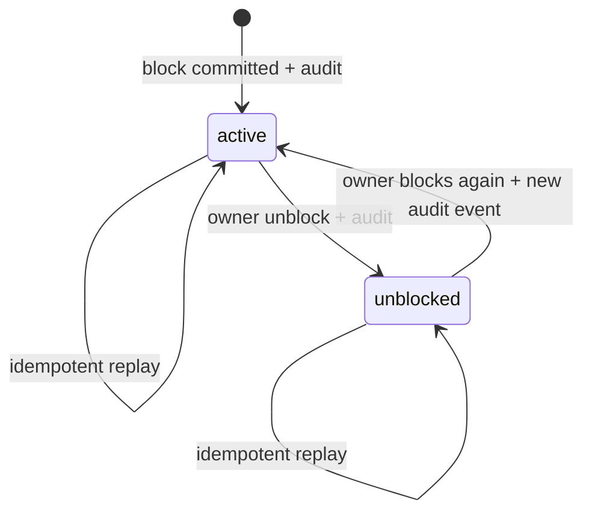
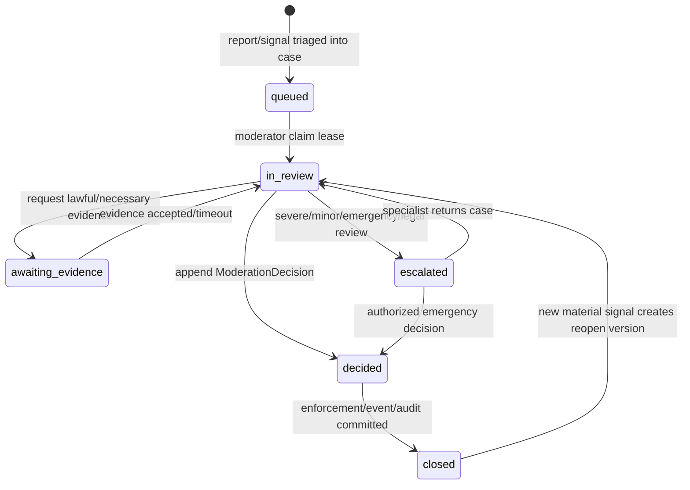
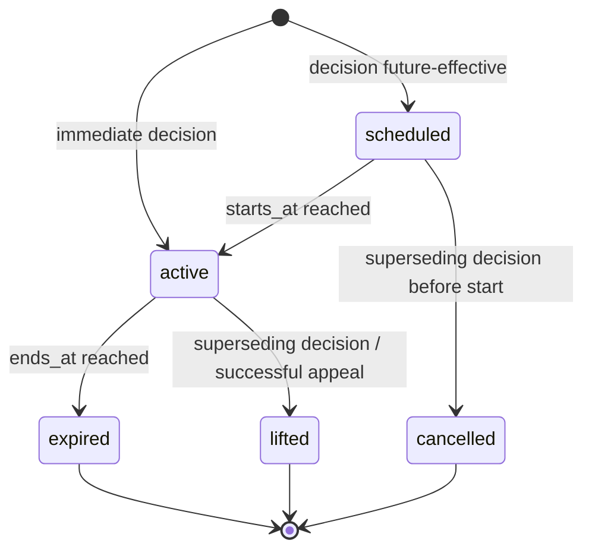
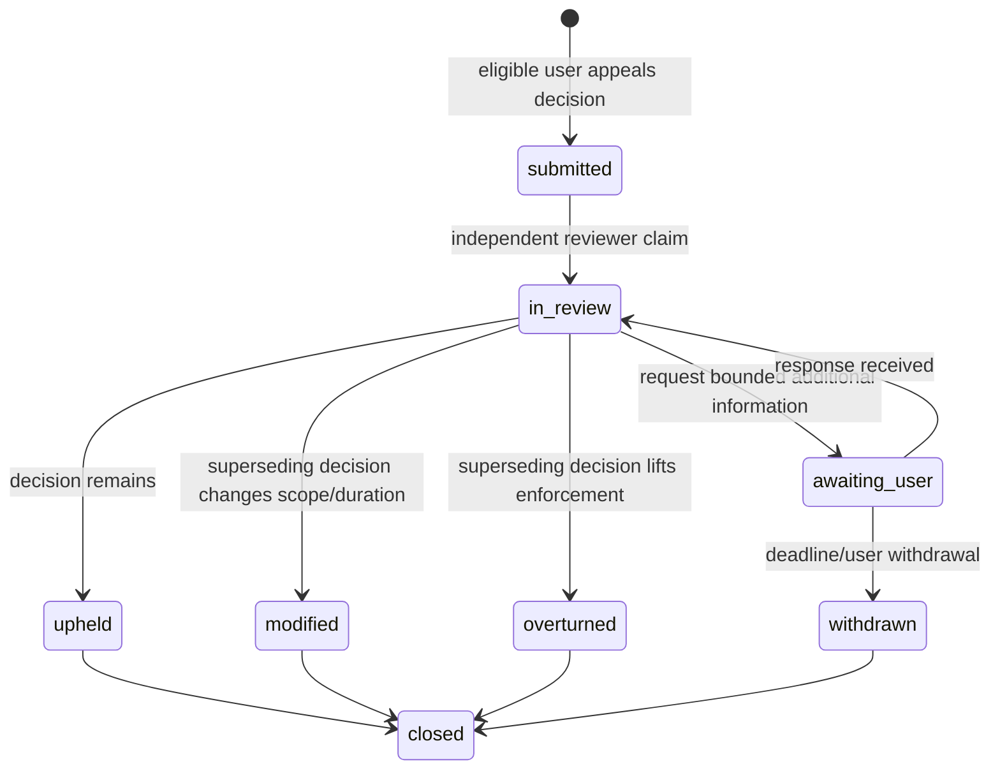

# Safety Service (module trong `core-api`) — đặc tả R-007 launch gate

> **Trạng thái**: foundation Block/Report đang được triển khai trong working tree; **R-007 chưa hoàn tất và chưa được dùng để tuyên bố anonymous matching/Message/Voice/Party production-ready**. File này phân biệt rõ foundation hiện tại (§ 2) với các gate còn mở (§ 14). Nguồn rule: [06 Domain Rules](../06-domain-rules.md), [10 Review Checklist](../10-code-review-checklist.md), [11 Production Readiness](../11-nfr-and-production-readiness.md).

## 1. Mục tiêu và boundary

Safety module sở hữu:

- quan hệ Block hai chiều enforcement từ hai bản ghi directed;
- intake Report, evidence metadata, priority và audit;
- moderation case/assignment/decision, enforcement và appeal;
- policy evaluation cho age assurance, account/device restriction và feature access;
- hợp đồng đồng bộ để Matching/Message/Calling/Party re-check tại thời điểm hành động;
- event tối giản cho cache invalidation, workflow và analytics an toàn.

Safety module không:

- tự lưu binary evidence trong bảng nghiệp vụ;
- để client quyết định priority, enforcement, trust score hoặc “đủ tuổi”;
- dùng IP/device fingerprint như bằng chứng duy nhất để permanent-ban;
- tự động gửi dữ liệu cho cơ quan bên ngoài nếu chưa qua policy + người có thẩm quyền;
- để consumer đọc trực tiếp bảng nội bộ thay vì gọi policy interface/event contract.

## 2. Foundation đang được triển khai — không phải full launch gate

Snapshot foundation hiện có trong working tree:

| Thành phần | Contract foundation |
|---|---|
| `user_blocks` | Một quan hệ block directed `(blocker, blocked)`, state `active/unblocked`, optimistic version, không self-block |
| `safety_reports` | Intake report `submitted`; category allowlist; priority do server derive; summary ngắn |
| `report_evidence_metadata` | Chỉ reference UUID + kind/hash/content-type/size; không URL/blob/base64 |
| `safety_operations` | Idempotency append-only scope `(actor, kind, key)` + request hash cho block/unblock/report |
| `safety_audit_events` | Audit append-only bằng DB trigger cho block activated/removed/report submitted |
| DTO foundation | Validate target/category/evidence reference/count/type/size ở boundary |

Các thuộc tính đúng đã có trong schema chưa đủ để launch. Foundation chưa đồng nghĩa đã có moderation queue, decision/enforcement/appeal, evidence object-store/access, age-assurance, device policy, emergency playbook hoặc enforcement tích hợp ở mọi feature. Trạng thái code cụ thể chỉ được đổi thành “implemented” sau khi module/service/controller/migration/test cùng pass; docs không suy diễn từ entity scaffold.

## 3. Domain model đích

### 3.1 Block và Report intake

- **`UserBlock`**: current state directed. Enforcement giữa A/B là deny nếu tồn tại active block ở **bất kỳ chiều nào**.
- **`SafetyReport`**: intake bất biến về reporter/subject/category/context; không dùng status report làm toàn bộ workflow moderation.
- **`ReportEvidenceMetadata`**: reference tới resource server-owned hoặc evidence object đã ingest; không nhận arbitrary URL.
- **`SafetyOperation`**: immutable idempotency record cho thao tác user.
- **`SafetyAuditEvent`**: append-only audit; không chứa raw evidence/summary nhạy cảm.

### 3.2 Moderation và enforcement còn phải triển khai

| Entity | Vai trò/bất biến |
|---|---|
| `ModerationCase` | Gom một/nhiều report/signal cùng subject; priority/SLA/policy version; một owner lease tại một thời điểm |
| `ModerationCaseReport` | Join immutable case↔report; report không bị “move” mất lịch sử |
| `ModerationDecision` | Append-only quyết định có actor, reason code, evidence refs, policy version, supersedes decision; không update quyết định cũ |
| `UserEnforcement` | Restriction có scope (`account`, `matching`, `messaging`, `calling`, `party`, `feed`, `gift`, `device`), start/end, decision, state |
| `SafetyAppeal` | Một appeal active/decision/user; state/owner/SLA; outcome tạo decision mới, không sửa decision gốc |
| `AgeAssuranceCheck` | Provider/method/assurance-level/result/expiry; không lưu raw document/biometric nếu chưa có privacy approval |
| `DeviceAccountSignal` | Pseudonymous device/account link + confidence/reason/expiry; risk signal, không phải định danh tuyệt đối |
| `EvidenceObject` | Object-store key nội bộ, hash, encryption key ref, scan status, retention class/legal hold; không public URL |
| `EvidenceAccessAudit` | Ai xem/export gì, purpose/case/timestamp/result; append-only |

Admin/moderator là actor riêng (`actor_type`, `actor_id`, role), không ghi `null` rồi coi đồng thời là system/admin.

## 4. State machines

### 4.1 Block

Block/unblock current-state row có thể update, nhưng mọi transition phải ghi operation + audit trong cùng DB transaction. Unblock không tự khôi phục friendship, conversation membership, room invitation hoặc notification đã bị revoke.

### 4.2 Report intake và Moderation Case

`SafetyReport.status=submitted` là intake record; workflow nằm ở `ModerationCase` để giữ report immutable.

Case claim dùng lease/expiry hoặc row lock; moderator crash không giữ case vô hạn. Reopen không xoá decision cũ và phải ghi reason/audit.

### 4.3 Decision và Enforcement

Decision là append-only, không có transition update. Muốn sửa sai, tạo decision mới `supersedes_decision_id` và reconcile enforcement.

Các outcome tối thiểu phải dùng reason-code allowlist: `no_violation`, `warning`, `feature_restriction`, `temporary_suspension`, `account_ban`, `age_verification_required`, `escalate_specialist`, `preserve_evidence`. Policy quyết định outcome nào cần dual control.

### 4.4 Appeal

Reviewer không được là người ra quyết định gốc với case yêu cầu independent review. Appeal outcome, enforcement change và notification phải atomic/outbox-backed.

## 5. Block/Report foundation contract

### Block

- Directed storage, symmetric interaction deny: A block B hoặc B block A đều chặn pair/message/call/invite/friend unlock.
- Block có hiệu lực sau DB commit; cache chỉ là optimization và phải invalidated bằng event/version.
- Target không nhận notification tiết lộ ai block mình.
- Block không xoá evidence/audit; không được dùng unblock để bypass recent-pair/report exclusion.
- Self-block, unknown target, already active/unblocked và concurrent toggle phải có deterministic idempotent behavior.

### Report

- Reporter không được report chính mình; reported user tồn tại và context reference phải thuộc/được reporter quan sát hợp lệ.
- Client chọn category, nhưng server derive `priority`. `suspected_minor`, credible threat/violence và policy-defined sexual safety signal đi urgent route; client không tự set urgent.
- Report không tự động đồng nghĩa có vi phạm/trust penalty. Aggregate signal phải chống brigading, correlated accounts và repeated false report.
- Reporter chỉ xem report của mình với view tối giản; subject không được xem identity/summary/evidence của reporter.
- Submission không được auto-unblock; UI có thể đề nghị block, nhưng hai operation/idempotency record tách rõ.

## 6. Age-assurance policy boundary

Ngày sinh tự khai chỉ là age declaration, **không phải assurance**. Trước launch phải có policy versioned theo market:

- minimum age, feature eligibility và assurance level cần cho anonymous text/voice/party/gift;
- trạng thái `unverified`, `pending`, `verified_adult`, `inconclusive`, `failed`, `expired` và transition/expiry;
- provider/method được duyệt, fallback/manual review, retry/cooldown và appeal;
- dữ liệu tối thiểu server lưu (provider ref, result, assurance level, timestamps), không mặc định giữ document/face image;
- account bị nghi là minor: freeze feature rủi ro ngay theo policy, tạo urgent case, không tiết lộ reporter, review ưu tiên;
- không permanent-ban chỉ từ một automated age estimate; quyết định material cần review/appeal theo policy/jurisdiction.

Policy engine trả eligibility/restriction + `policyVersion`; feature module không tự đoán “đủ 18” từ birth date.

## 7. Device/account enforcement boundary

Device fingerprint, IP, phone/social identity, payment/refund và behavior chỉ là signal có confidence/provenance/expiry:

- pseudonymize/rotate device identifier; không dùng raw advertising ID/IP làm durable public identity;
- shared device/NAT là tình huống hợp lệ; không permanent-ban toàn bộ account chỉ bằng một device/IP match;
- device-level guest quota phải atomic và chống reset account, nhưng có recovery khi false positive/device change;
- ban-evasion case gom signal, decision do policy/authorized reviewer; enforcement có scope/duration/reason/appeal;
- access tới device-account graph là privileged và được audit; retention được privacy/legal duyệt;
- event/DTO không phát tán raw device/IP cho module khác; consumer chỉ nhận risk tier/restriction cần thiết.

## 8. Evidence retention, privacy và access

Foundation chỉ có metadata. Full gate cần pipeline:

1. Resolve server-owned reference và xác minh reporter được phép viện dẫn.
2. Ingest/copy evidence vào object store riêng; encrypt, hash, malware/content scan, immutable provenance.
3. Gắn retention class/policy version/legal hold; không dùng client URL làm evidence lâu dài.
4. Moderator xem qua short-lived internal access, least privilege, watermark khi cần; mọi view/export ghi `EvidenceAccessAudit` với purpose/case.
5. Export/share ngoài hệ thống cần authorized workflow/dual control; không gửi qua log/chat thông thường.
6. Hết retention thì object delete/crypto-erase theo policy; giữ tombstone/hash/audit tối thiểu nếu được phép. Legal hold override phải có actor/reason/expiry/review.

Retention matrix (standard report, substantiated abuse, minor/emergency, appeal, access audit) phải có owner, duration, jurisdiction, deletion rule và legal approval trước G3. Không hardcode số ngày trong service khi chưa duyệt; record snapshot `retentionPolicyVersion`.

## 9. Emergency và suspected-minor escalation

- Urgent classifier/rule chỉ route priority, không tự kết luận guilt.
- `suspected_minor`: restrict high-risk matching/call/party theo policy, page specialist queue, preserve necessary evidence, target first-human-review SLA ở § 13.
- Credible imminent threat/self-harm/violence: page trained on-call, preserve evidence, follow market-specific emergency runbook and authorized disclosure process.
- CSAM/illegal-content suspicion: không để moderator tải/copy tự do; quarantine, access restriction và specialist/legal procedure riêng.
- Mọi emergency override có actor, reason, time-bound scope, dual control khi policy yêu cầu và post-incident review.
- Runbook phải chứa jurisdiction/provider contacts nhưng secret/contact detail không đặt trong public event/log.

## 10. Enforcement points — re-check tại thời điểm hành động

Policy interface đồng bộ đề xuất:

`evaluate({ actorUserId, action, targetUserId?, resourceId?, context }) → { allowed, restrictions, reasonCodeForServer, policyVersion, enforcementVersion }`

Client chỉ nhận error code an toàn; không lộ report/case/reporter/reason nội bộ.

| Boundary | Bắt buộc re-check |
|---|---|
| Auth/session refresh | account suspension/ban, age re-verification requirement |
| Matching create | actor active, age/feature eligibility, device/guest quota, matching restriction |
| Matching pair commit | **cả hai chiều Block**, current enforcement/age, recent safety exclusion; không tin check lúc enqueue |
| Soul/anonymous message send | block/enforcement mỗi send; attachment policy; session still authorized |
| Like/friend/profile unlock | block/enforcement ngay trước atomic friendship/unlock |
| Long-lived Message | block/message restriction mỗi send; revoke delivery/push; history visibility policy riêng |
| Call token mint | block/calling restriction/age ngay trước mint token |
| Call join/start billing | re-check khi cả hai join; enforcement event có thể end room/revoke future token qua `core-api` |
| Party join/invite | block với inviter/host theo policy, party restriction/age/capacity |
| Party speaker grant/unmute | role + safety restriction dưới room lock; host không override platform ban |
| Gift | block/gift restriction/guest/age + Economy check trước commit |
| Feed/comment/reaction | block visibility cả dữ liệu đã fanout/cache và tương tác mới |
| Notification | suppress blocked/restricted contact; không leak action subject |

Block/enforcement commit phải phát outbox event để invalidate cache/session; consumer dùng Inbox. Khi Safety unavailable, high-risk action (pair commit, token mint, message send, party speaker, gift) fail closed hoặc dùng bounded signed policy snapshot theo ADR; không silently allow vô hạn.

## 11. API contract

### 11.1 User foundation

Base `/api/v1/safety`:

| Method | Path | Idempotency | Contract |
|---|---|---|---|
| `POST` | `/blocks` | `Idempotency-Key` required | activate directed block + operation + audit atomically |
| `DELETE` | `/blocks/:blockedUserId` | `Idempotency-Key` required | unblock current relation + audit; no friendship restoration |
| `GET` | `/blocks` | — | cursor list block do current user tạo; không lộ inbound blocker |
| `POST` | `/reports` | `Idempotency-Key` required | submit report/evidence refs; priority server-derived |
| `GET` | `/reports/:id` | — | reporter-owned minimal status/view only |
| `POST` | `/appeals` | `Idempotency-Key` required | future gate: appeal eligible decision |
| `GET` | `/appeals/:id` | — | appellant-owned minimal status/outcome |

### 11.2 Admin/moderation — còn mở

Admin endpoints tách namespace/auth/audit, cursor pagination và least-privilege scope:

- list/claim/release case; claim có lease/version;
- add case note/reference, request evidence, escalate;
- record append-only decision và enforcement trong transaction/outbox;
- review appeal độc lập; create superseding decision;
- request short-lived evidence access/export với purpose;
- search subject/case chỉ theo authorized reason; mọi query nhạy cảm audit.

Không trả ORM entity/raw PII; bulk action cần dry-run, cap, dual approval và idempotency.

## 12. Idempotency, concurrency và events

### Idempotency/concurrency

- User operation unique `(actor_user_id, kind, idempotency_key)` + canonical request hash; same key/different payload → 409.
- Block row unique `(blocker, blocked)`; block/unblock dùng row lock/version/conditional state + operation + audit cùng transaction.
- Report create + evidence metadata + operation + audit atomic; retry không tạo hai report.
- Case claim dùng lease owner/deadline/version; expired lease reclaim được, stale owner không quyết định.
- Decision append-only unique `(case_id, decision_version)`; enforcement reconcile idempotently theo decision.
- Một active appeal/decision/appellant; concurrent appeal/decision close re-check eligibility dưới lock.
- Enforcement evaluation có monotonic version; cache không được áp older version sau event reorder.

### Events

Outbox event tối thiểu:

- `safety.block.activated`, `safety.block.removed`, `safety.report.submitted`;
- `safety.case.priority_changed`, `safety.decision.recorded`;
- `safety.enforcement.activated|modified|lifted|expired`;
- `safety.appeal.submitted|resolved`, `safety.age_assurance.changed`.

Envelope theo [03 § 3.6](../03-architecture.md). Payload không chứa summary, evidence, raw device/IP, reporter identity ngoài consumer privilege. Matching/Message/Calling/Party consumer dedup event và vẫn synchronous re-check ở action boundary; event không phải authorization source duy nhất.

## 13. NFR, metrics và operational acceptance

### SLO planning v0 — cần Safety/Product/Legal duyệt trước launch

| SLI | Target v0 |
|---|---:|
| Synchronous block/enforcement evaluation | p95 ≤ 50 ms, p99 ≤ 150 ms cùng region |
| Block/report write | p95 ≤ 500 ms, zero duplicate effect |
| Block propagation tới cache/realtime consumer | p99 ≤ 2 giây; high-risk boundary vẫn synchronous re-check |
| Urgent report durable route/page | ≤ 60 giây |
| Suspected-minor/emergency first human review | ≤ 15 phút, 24×7 on-call trước launch |
| Standard report first review | ≤ 24 giờ |
| Eligible appeal first review | ≤ 7 ngày |
| Evidence view/export | 100% có access audit; zero unauthorized cross-case access |

### Metrics tối thiểu

- block activate/unblock/error/conflict + evaluation latency/cache age/deny reason;
- reports by category/priority/status/region, reporter rate, suspected brigading/false-report signal;
- case queue depth/oldest age/SLA breach/claim lease expiry/reopen;
- decision/enforcement by reason/scope/duration, override/lift/expiry and appeal overturn rate;
- urgent/minor page latency/acknowledgment/escalation;
- evidence ingest/scan/access/export/delete/legal-hold and denied access;
- age-assurance result/expiry/retry/manual review without raw biometric/document metric labels;
- device/account risk decision false-positive/appeal rate;
- enforcement cache/event lag and policy-version skew at every consumer.

Alerts có owner/runbook; metric/log không chứa reporter/evidence/message/phone/device/IP raw value.

## 14. R-007 acceptance checklist

### Foundation slice — đang triển khai, không đủ launch

- [ ] Migration/entities/service/controller cho Block/Report/evidence metadata/operation/audit được đăng ký đầy đủ
- [ ] Foundation unit + Postgres integration race: duplicate key, payload conflict, block↔unblock race, report replay, append-only trigger, ownership/IDOR/rate limit
- [ ] Matching pair commit và các feature consumer có synchronous bidirectional block check

### Full launch gate còn mở

- [ ] ModerationCase/Decision/UserEnforcement schema, admin RBAC/lease/API/audit và outbox
- [ ] Appeal eligibility/state/SLA/independent review + superseding-decision behavior
- [ ] Age-assurance market policy/provider/privacy/manual fallback/expiry/appeal
- [ ] Device/account signal privacy, atomic guest quota, ban-evasion decision và false-positive recovery
- [ ] Evidence object-store ingest/scan/encryption/access audit/retention/delete/legal hold
- [ ] Emergency/minor specialist queue, 24×7 on-call, disclosure/legal runbooks và drill
- [ ] Enforcement integration tests cho Matching create+pair, Soul/Message, friend unlock, token mint/call join, Party join/speaker, Gift, Feed/Notification
- [ ] Cache invalidation/outbox/inbox, fail-closed behavior, event reorder/version tests
- [ ] Metrics/dashboard/SLO paging, backlog/load/soak/chaos, privacy/security/penetration review
- [ ] Evidence ở [11 § 11.8](../11-nfr-and-production-readiness.md), owner sign-off và rollback/kill switch

Chỉ khi toàn bộ “Full launch gate” pass mới tick R-007 và bật anonymous matching/Message/Voice/Party production.
